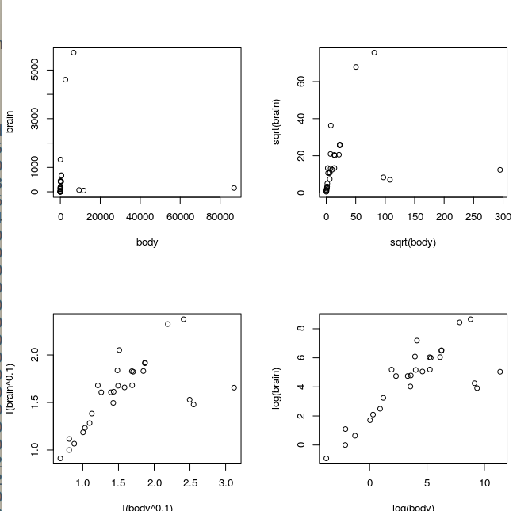
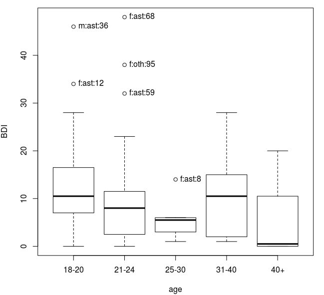
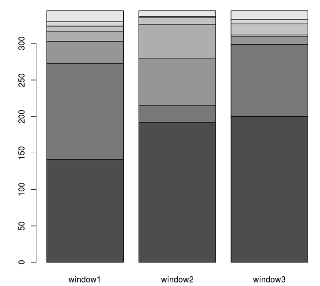
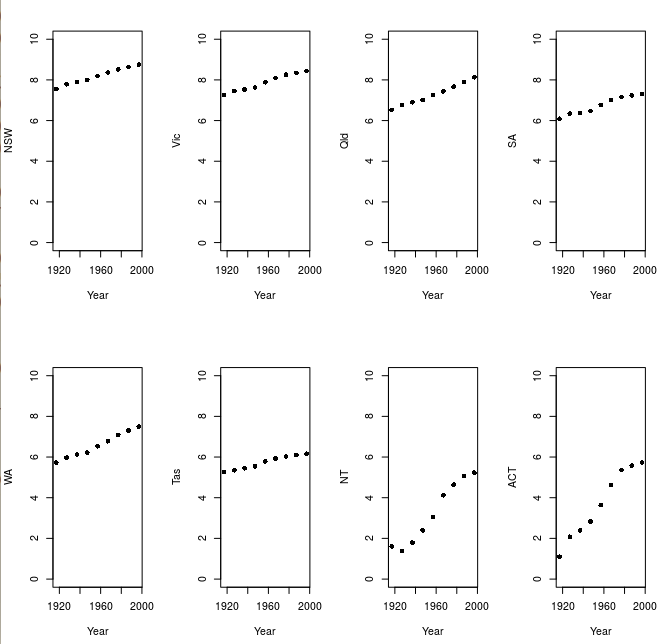

# 1.2

```R
> rows = c(1, 2, 4, 11, 13, 18)
> cut = orings[rows,]
> cut
   Temperature Erosion Blowby Total
1           53       3      2     5
2           57       1      0     1
4           63       1      0     1
11          70       1      0     1
13          70       1      0     1
18          75       0      2     1
> png(filename="oring_cut.png")
> plot(cut$Temperature, cut$Total)
> dev.off()
> png(filename="oring.png")
> plot(orings$Temperature, orings$Total)
> dev.off()
```


# 1.3

## A

```R
> str(possum)
'data.frame':	104 obs. of  14 variables:
 $ case    : num  1 2 3 4 5 6 7 8 9 10 ...
 $ site    : num  1 1 1 1 1 1 1 1 1 1 ...
 $ Pop     : Factor w/ 2 levels "Vic","other": 1 1 1 1 1 1 1 1 1 1 ...
 $ sex     : Factor w/ 2 levels "f","m": 2 1 1 1 1 1 2 1 1 1 ...
 $ age     : num  8 6 6 6 2 1 2 6 9 6 ...
 $ hdlngth : num  94.1 92.5 94 93.2 91.5 93.1 95.3 94.8 93.4 91.8 ...
 $ skullw  : num  60.4 57.6 60 57.1 56.3 54.8 58.2 57.6 56.3 58 ...
 $ totlngth: num  89 91.5 95.5 92 85.5 90.5 89.5 91 91.5 89.5 ...
 $ taill   : num  36 36.5 39 38 36 35.5 36 37 37 37.5 ...
 $ footlgth: num  74.5 72.5 75.4 76.1 71 73.2 71.5 72.7 72.4 70.9 ...
 $ earconch: num  54.5 51.2 51.9 52.2 53.2 53.6 52 53.9 52.9 53.4 ...
 $ eye     : num  15.2 16 15.5 15.2 15.1 14.2 14.2 14.5 15.5 14.4 ...
 $ chest   : num  28 28.5 30 28 28.5 30 30 29 28 27.5 ...
 $ belly   : num  36 33 34 34 33 32 34.5 34 33 32 ...
```

## B

```R
> print(possum[!complete.cases(possum),])
     case site Pop sex age hdlngth skullw totlngth taill footlgth earconch  eye
BB36   41    2 Vic   f   5    88.4   57.0       83  36.5       NA     40.3 15.9
BB41   44    2 Vic   m  NA    85.1   51.5       76  35.5     70.3     52.6 14.4
BB45   46    2 Vic   m  NA    91.4   54.4       84  35.0     72.8     51.2 14.4
     chest belly
BB36  27.0  30.5
BB41  23.0  27.0
BB45  24.5  35.0
```

# 1.10

## A

```R
> 1000*((1+0.075)^5 - 1)
[1] 435.6293
```

## B

```R
> 1000*((1+0.035)^5 - 1)
[1] 187.6863
```

## C

```R
> 1000*((1+0.075)^seq(1,10) - 1)
 [1]   75.0000  155.6250  242.2969  335.4691  435.6293  543.3015  659.0491
 [8]  783.4778  917.2387 1061.0316
```

This is the cumulative interest after 1, 2, 3... years.

# 1.11

```R
> gender <- factor(c(rep("female", 91), rep("male", 92)))
> table(gender)
gender
female   male 
    91     92 
> gender <- factor( gender, levels = c( "male", "female" ) )
> table(gender)
gender
  male female 
    92     91
> gender <- factor(gender, levels = c("Male", "female" ) )
> table( gender )
gender
  Male female 
     0     91 
> table( gender, exclude = NULL )
gender
  Male female   <NA> 
     0     91     92
> rm( gender)
```

God, the documentation for `?table` is so jargon-y. I think table counts the number of factors, or unique elements, in its argument. Apparently this is called a _contingency table_.

* In the first output, table tells us there are 91 "female" entries and 92 "male" entries, as we constructed directly above.

* In the 2nd output, we have re-defined gender by explicitly specifying its factors as "male" and "female". Since these were already the factors, all this did was change the order in which the items are reported.

* In the third output, we have done the same as in the second, but misspelled "male" as "Male". When table tries to count "Males", it finds none, so it tells us there are 0 entries of "Male" and 91 of "female".

* In the last table entry, it would seem exclude = NULL is telling the function not to exclude anything from the table summary. The description in the documentation is garbage, so this is just empirical.

  * >  exclude: levels to remove for all factors in ‘...’.  If it does not
    >           contain ‘NA’ and ‘useNA’ is not specified, it implies ‘useNA
    >           = "ifany"’.  See ‘Details’ for its interpretation for
    >           non-factor arguments.

# 1.13

```R
> par( mfrow=c(2,2) )
> plot( brain ~ body, data = Animals )
> plot( sqrt( brain ) ~ sqrt( body ), data = Animals )
> plot( I( brain^0.1 ) ~ I( body^0.1 ), data = Animals)
> plot( log( brain ) ~ log( body ), data = Animals )
> par( mfrow=c(1,1) )
```



1. Plot 1 is just a regular plot of the data. It does a poor job showing any relationships because of the large range in values present.
2. Plot 2 has tried to condense the data ranges with `sqrt`. This does condense the data, but still doesn't show the small numbers well.
3. Plot 3 raises the data to the 0.1 power, which does a much nicer job at showing scaling across many orders of magnitudes. However, this will only appear linear for data that has a scaling relationship of $y = x^{10}$. 
4. This takes the log of the data, an astronomer's favorite! It makes all power relationships appear linear, where the slope of the line through the data is the exponent of the power relationship (e.g. $y = x^5$ implies data on a log log plot will have a slope of 5.)

# 1.16

```R
> head(socsupport)
  gender   age   country marital   livewith         employment    firstyr
1   male 21-24 australia   other    partner employed part-time      other
2 female 21-24 australia  single    partner   parental support      other
3   male 21-24 australia  single residences employed part-time      other
4   male 18-20 australia  single    parents employed part-time first year
5 female 21-24 australia  single    friends employed part-time      other
6 female 21-24 australia  single    friends    govt assistance      other
  
  enrolment emotional emotionalsat tangible tangiblesat affect affectsat psi
1 full-time        22           23       17          18     15        15  12
2 full-time        21           20       12          10     10         6   9
3 full-time        21           18       16          16     15        15  13
4 full-time        19           19       20          17     11        11  13
5 full-time        16           19       11          15      6        10  11
6 full-time        20           17       16          15     12        14  12
  
  psisat esupport psupport supsources BDI
1     13       13       11         13   5
2      6       12        7         10   8
3     12       14       13         14  16
4     12       15       15         15   0
5     12        9        7          9   9
6     11       13       12         13   0
> gender1 <- with( socsupport, abbreviate( gender, 1 ) )
> table( gender1 )
gender1
 f  m 
71 24
> country3 <- with( socsupport, abbreviate( country, 3 ) )
> table(country3)
country3
ast oth 
 85  10
> lab <- paste( gender1, country3, num, sep = ":" )
> lab
 [1] "m:ast:1"  "f:ast:2"  "m:ast:3"  "m:ast:4"  "f:ast:5"  "f:ast:6" 
 [7] "f:ast:7"  "f:ast:8"  "f:ast:9"  "m:ast:10" "f:ast:11" "f:ast:12"
...
> plot(BDI ~ age, data = socsupport)
> > with(socsupport, identify(age, BDI, labels = lab, plot=TRUE))
^C
[1]  8 12 36 59 68 95
```



# 1.19

```R
> head(vlt, 4)
  window1 window2 window3 prize night
1       2       0       0     0     1
2       0       5       1     0     1
3       0       0       0     0     1
4       2       0       0     0     1
> vltcv <- stack(vlt[,1:3])
> head( vltcv )
  values     ind
1      2 window1
2      0 window1
3      0 window1
4      2 window1
5      0 window1
6      0 window1
> table( vltcv$values, vltcv$ind )
   
    window1 window2 window3
  0     141     192     200
  1     132      23      99
  2      30      65      11
  3      14      46       3
  5       7      10      14
  6       6       1       6
  7      15       8      12
> counts = table(vltcv)
> barplot(counts)
```

> Stacking vectors concatenates multiple vectors into a single
> vector along with a factor indicating where each observation
> originated.  Unstacking reverses this operation.

> Does any window stand out as different?



I don't think so. I mean, they all seem to have different distributions.

# 1.21

```R
> oldpar <- par(mfrow=c(2,4))
> for( i in 2:9 ){
+     plot( austpop[,1], log( austpop[,i]), xlab = "Year", 
           ylab = names(austpop)[i], pch=16, ylim=c(0,10))
+ }
> par(oldpar)
```



> Apply a Function over a List or Vector
>
> Description:
>
> ‘lapply’ returns a list of the same length as ‘X’, each element of
>  which is the result of applying ‘FUN’ to the corresponding element
>  of ‘X’.
>
>  ‘sapply’ is a user-friendly version and wrapper of ‘lapply’ by
>  default returning a vector, matrix or, if ‘simplify = "array"’, an
>  array if appropriate, by applying ‘simplify2array()’.  ‘sapply(x,
>  f, simplify = FALSE, USE.NAMES = FALSE)’ is the same as ‘lapply(x,
>  f)’.

```R
> myplot <- function(i){
+ plot( austpop[,1], log( austpop[,i]), xlab = "Year", ylab = names(austpop)[i], pch=16, ylim=c(0,10))
+ }
> oldpar <- par(mfrow=c(2,4))
> sapply(2:9, myplot)
```

This seems to do it. There's probably a cleaner way...


