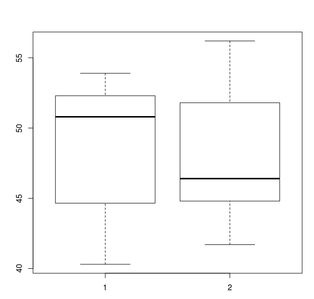

# 2.3

```R
> possum <- read.csv("possum.txt", sep=",", header=FALSE)
> head(possum)
  V1 V2 V3 V4 V5   V6   V7   V8   V9  V10  V11  V12  V13 V14
1  1  1  1  2  8 94.1 60.4 89.0 36.0 74.5 54.5 15.2 28.0  36
2  2  1  1  1  6 92.5 57.6 91.5 36.5 72.5 51.2 16.0 28.5  33
3  3  1  1  1  6 94.0 60.0 95.5 39.0 75.4 51.9 15.5 30.0  34
4  4  1  1  1  6 93.2 57.1 92.0 38.0 76.1 52.2 15.2 28.0  34
5  5  1  1  1  2 91.5 56.3 85.5 36.0 71.0 53.2 15.1 28.5  33
6  6  1  1  1  1 93.1 54.8 90.5 35.5 73.2 53.6 14.2 30.0  32
> with(possum, hist(V11)) #earconch is column 11
> with(possum, boxplot(V11~V4)) #sex is column 4 
...
> par(mfrow=c(1,2)) #2 histograms
> hist(possum[possum$V4==1,11])
> hist(possum[possum$V4==2,11])
```




The measurement distributions have a similar range (with sex 2 having more extreme high values), but with significantly shifted peaks. Sex 1 has its median quite close to the 75th percentile, whereas sex 2 has its peak very close to the 25th percentile. The histogram for 1 would have a tail at the low end, with a peak around 50, and a sharp drop off. The histogram for sex 2 would be similar, but mirrored about x = ~47.


Hmm... I didn't quite guess right. I didn't expect there to be bimodal distributions in the separation by sex based on the box plots. I'm not sure I understand - I would expect that if there were significant numbers of low values for sex 1, then its median would be closer to halfway between the 25th and 75th percentiles. I guess now that I think about it, you wouldn't be able to distinguish the low end distribution accurately just from the box plot.

# 2.5

File format [here](http://math.furman.edu/~dcs/courses/math47/R/library/DAAG/html/cuckoohosts.html).

```R
> cuckoo <- read.csv("cuckoohosts.txt",sep = ",", header = FALSE)
> head(cuckoo)
    V1   V2   V3   V4 V5    V6    V7    V8    V9 V10 V11 V12
1 22.3 0.89 16.7 0.38 45 19.70  1.25 14.60  0.56  74  56   6
2 23.1 1.01 16.8 0.52 14 20.10  0.81 14.70 14.70  26   1  19
3 22.5 0.66 16.4 0.53 16 20.20  0.86 15.40 15.40  57   7  11
4 22.6 0.90 16.6 0.45 26 20.75  1.44 14.67  0.37  16  26   3
5 23.1 0.85 16.6 0.44 15 20.00  0.70 15.10  0.48  27  11   4
6 21.1 0.76 15.8 0.30 15 17.70 17.70 12.70  0.37  NA   0  17
> with(cuckoo, plot(c(V1,V6),c(V3, V8),col=c(rep(1,10),rep(2,10))))
> for(i in 1:10)
+   with(cuckoo, lines(c(V1[i],V6[i]),c(V3[i], V8[i])))
> with(cuckoo, text(V6, V8, rownames(cuckoo)))
```


A long line implies that the cuckoo eggs in that particular nest were very different (length and/or breadth-wise) compared to the host eggs. Short lines indicate cuckoo eggs that are quite similar (on average) to the host bird's eggs.

# 2.10

I believe this dataset is described [here](https://vincentarelbundock.github.io/Rdatasets/doc/MASS/Animals.html).

```R
> animals <- read.csv("Animals.txt",sep = ",", header = FALSE)
> head(animals)
        V1    V2
1     1.35   8.1
2   465.00 423.0
3    36.33 119.5
4    27.66 115.0
5     1.04   5.5
6 11700.00  50.0
> with(animals, cor(V2, V1))
[1] -0.005341163
> with(animals, cor(log(V2), log(V1)))
[1] 0.7794935
> with(animals, cor(log(V2), log(V1), method="spearman"))
[1] 0.7162994
> par(mfrow=c(1,2))
> with(animals, plot(V1,V2))
> with(animals, plot(log(V1),log(V2)))
```

From the documentation:

> ‘var’, ‘cov’ and ‘cor’ compute the variance of ‘x’ and the
>  covariance or correlation of ‘x’ and ‘y’ if these are vectors.  If
>  ‘x’ and ‘y’ are matrices then the covariances (or correlations)
>  between the columns of ‘x’ and the columns of ‘y’ are computed.
>
>  ‘cov2cor’ scales a covariance matrix into the corresponding
>  correlation matrix _efficiently_.
>
> ...
>
> For ‘cor()’, if ‘method’ is ‘"kendall"’ or ‘"spearman"’, Kendall's
>  tau or Spearman's rho statistic is used to estimate a rank-based
>  measure of association.  These are more robust and have been
>  recommended if the data do not necessarily come from a bivariate
>  normal distribution.
>  For ‘cov()’, a non-Pearson method is unusual but available for the
>  sake of completeness.  Note that ‘"spearman"’ basically computes
>  ‘cor(R(x), R(y))’ (or ‘cov(., .)’) where ‘R(u) := rank(u, na.last
>  = "keep")’. In the case of missing values, the ranks are
>  calculated depending on the value of ‘use’, either based on
>  complete observations, or based on pairwise completeness with
>  reranking for each pair.


A [Bivariate Normal](https://en.wikipedia.org/wiki/Multivariate_normal_distribution) distribution is just something that is normal in 2 dimensions. This data certainly doesn't look normal to me, so I would guess that the Spearman correlation of the log data is the most appropriate here.

# 2.13

```R
> library(MASS)
> library(vioplot)
> head(galaxies)
[1]  9172  9350  9483  9558  9775 10227
> hist(galaxies)
> boxplot(galaxies)
> vioplot(galaxies)
```


The distribution does not look skewed to me. It seems quite clustered around ~22,000. There is something interesting going on around 10,000 - a lot of low end "outliers". This could perhaps be a 2nd population that hasn't been sampled well enough to see smaller distribution below 10,000 (and in fact could b observation bias if it's more difficult to see lower speed galaxies).

# Preliminary Exploratory Data Analysis

