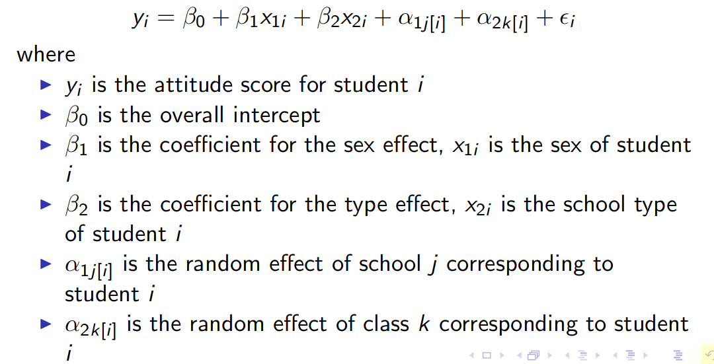
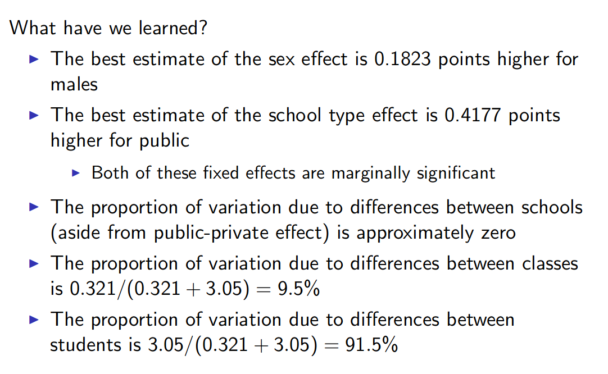

# Mixed Effects Models

Motivating problem: interest in science from students in public and private schools. Questions:

* Public vs private?
* Class size?
* Boys vs girls?
* Differences between schools and classes greater than it would be if it was just due to student-to-student differences.

Sources of variance:

* Gender effect
* school type effect
* school effect
* class effect
* student effect

_Fixed effect_: we care of levels of factor (if we have all school represented, we're not treating the schools as a sample representing the real distribution).

* Inference limited to levels observed
* In designed experiment, levels are chosen by experimenter
* Examples above: Gender, school type

_Random effect_: Just assume values drawn from an overall distribution

- Inference can be generalized to other levels that were not observed
- In designed experiment, levels chosen randomly
- There is nothing "special" about levels included
- Examples from above: School effect, class effect, student effect

Model attitude as

attitude = sex + type + school + class + student

Vectors of random effects, $\alpha_1$, $\alpha_2$, $\epsilon_i$, each have their own distribution.

## What have we learned?

Most variation is due to differences between students, not between classes.

## Random Coefficients: Random Slopes

Looking at chicks on different diets. Diet looks like it might affect slope of chick weight over time.

Formula: sqrt(weight) ~ Time + (Time - 1| Chick) + Diet:Time

## Pooling

_Pooling_ refers to aggregation of observations into groups.

* _No Pooling_ - each classroom is a replicate. 
* _Complete Pooling_ - pool all classrooms together.
* _Partial Pooling_ - compromise achieved by modelling classroom effects as a group (mixed effect model)

The better of an idea we have about the overall mean (complete pooling) and the worse of an idea we have about an individual (no pooling), the more partial pooling will pull those individuals closer to the mean.

One interpretation of a measurement being pulled up by pooling: if we remeasured, it would be more likely to be closer to the mean than we saw the first time.

It seems worth it to do the different pooling techniques and compare them.

