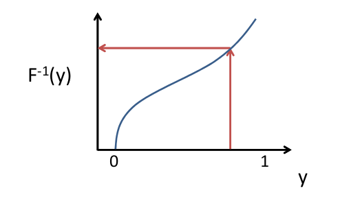

# Statistical Models

Often compartmentalized into signal component and noise component

* Signal deterministic
* Noise random

Signal often meaningful, but sometimes not (e.g. curve fitting).

Noise can be due to variation in process/measurements.

Additive error:

$$y_{i} = f(x_i) + \epsilon_i$$

Simple Linear Model:

$$y_i = \beta_0 + ...$$

Exponential Model:

...

## Models for Noise

* Bernouilli
  * Probability of success = p
  * Prob of failure = 1 - p
  * x = 1 if success, x = 0 if failure
  * Example: Did it rain?
  * Binomial with 1 trial
* Binomial
  * Sum of independent bernouillis
  * expected value is np
  * Variance is np(1-p)
  * Ex: number of days it rained last month? Assume days are independent, "rain" is well defined, probability of rain on any day is the same.
* Poisson
  * The number of events that occur in a given time or space interval
  * Events occur independently
  * $\lambda$ is expected value (mean) and variance
  * Ex: number of cars that will pass building in one minute
* Normal
  * Many processes follow normal dist, **especially sums or averages** (due to Central Limit Theorem)
  * Has nice properties, so used a lot in modeling
  * parameters are mean ($\mu$) and variance ($\sigma^2$)
  * Ex: grades on an exam
  * _Lognormal_ used when log of variable is normal, **used for multiplicative processes**.
  * Ex: Return on an investment

## Drawing from a Distribution

Drawing from statistical distribution:

1. draw random number from uniform (0,1) (drawing probability)
2. Map to random variable quantity using inverse cumulative distribution function $x = F^{-1}(y)$. (use probability to get value).

Cumulative distribution function: probability that a random variable is less than particular value (x).

