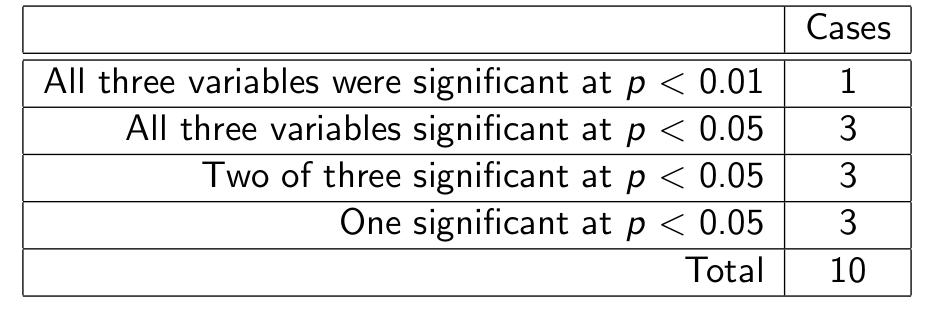

# Regression

$$y_i = \beta_0 + \beta_1x_i + \epsilon_i$$

* $\beta$ - coefficients
* $x_i$ - *predictors*
* $\epsilon_i$ - makes up the difference between the predictions and the observed values

**Assumption:** Given x~i~, the response $y_i \propto N(\beta_0 + \beta_1x_i, \sigma^2)$ and y~i~ are independent for all i.

In R, we can use `lm()` (linear model) to get a *best fit* solution.

## Regression Diagnostics

Check model assumptions and look for influential points.

```R
# weight is y, volume is x, the data we know
softbacks.lm = lm(weight ~ volume, data = softbacks)
summary(softbacks.lm)
# Gives us a bunch of nice plots related to the fit
plot(softbacks.lm, which = 1:4)
```

*Cooks Distance* - measure of influence of each point. "If we removed this point from the regression, how much would it change?" How does the magnitude of this number change with number of points?

## Interval, tests, robust regression

```R
predict(softbacks.lm,
       newdata = data.frame(volume=1200),
       interval="prediction")
#interval could also be "confidence"
```

"confidence" gives you the confidence interval just from the line given x, whereas "prediction" takes into account the $\epsilon$ from the model.

# Transformations

What if Y isn't linear with X? Can transform Y to be roughly linear with x.

*Box-Cox Transformation* - generalized transformation (function of $\lambda$) that tries to linearize Y. $\lambda$ is the power of the transformation, with $\lambda=0$ defined to be $\log{}$.

$$y(\lambda) = \frac{y^{\lambda} - 1}{\lambda}$$ if $\lambda \neq 0$.

## Suggested Steps for Multiple Regression

1. Check the distributions of the dependent and explanatory variables (skewness, outliers). Distribution of Y should be Gaussian. If it's not, it might still be OK, but proceed with caution. If residuals are not Gaussian, then there is a problem.
2. Plot a scatterplot matrix. Look for:
   * Non-linearities
   * Sufficient contrast (big enough range of x values)
   * (near) Collinearity
3. Consider whether there are large errors in the explanatory variables (assuming we know the X's, but do we?)
4. Consider transformations to improve linearity and/or symmetry of distributions
5. In the case of (near) collinearity, consider removing redundant explanatory variables
6. After fitting the model, check residuals, cooks distances, and other diagnostics

## Interpreting Model Coefficients

Look at slide 10, example of model of brain weight for mice as a function of litter size and body weight.

"Brain weight goes down with litter size" vs "given a body weight, brain weight actually goes up with litter size".

## Model Selection Criteria

Given a set of candidate models, how do we choose the "best" one? **The selection procedure should be based on the goal of analysis (e.g. hypothesis testing vs estimation vs prediction)?**

Note that a "different" model means it uses different features (not just different parameters for the same features).

*Estimation* - what is the relationship between x and y?

*Prediction* - what is Y given x, don't care about why.

Examples:

* Hypothesis tests on each coefficient
* Total model comparison using hypothesis testing (F-testing)
* Total model comparison using information criteria (AIC, BIC)
* Prediction performance on test set
* Cross validation - fancier version of above. Leave out sections (folds) and predict fold after fitting.

## Simulation Experiment (In Book)

Generate random vectors, first vector is y, rest as X, which best describe y?




 These are all noise! Need to be careful that you're not chasing noise.

## Assessing Predictive Power

Looking for a model that minimizes $\mathcal{L}(\hat{y(\theta, X_{future}),y(X_{future})})$.

* Do we have true model? Finite sample errors?
* Using appropriate criterion?

## Cross-Validation

How can we get a handle on prediction error?

* Divide set into training and test set
* Use train to get models
* Predict test set and compare

CV is extension is extension:

* Divide into K folds
* Train in K-1 folds
* Predict removed fold
* Repeat for all folds
* Average across folds

## Multicollinearity

* Explanatory variables that are (nearly) linear combinations of other explanatory variables are *colinear*
* Extreme example is compositional data (fractions of whole) (if we know total fraction and 4 compositions, can figure out 5th.) e.g. all compositions add to 100%

## Variance Inflation Factor

* The standard errors of regression coefficients are influenced by correlation with other explanatory variables.
* *Variance Inflation Factor* measures this effect.
* Compare variance of A to variance of A after adding B, where A and B are coefficients in the model.
* Normally labelled $\gamma$.

Large $\gamma$ implies strong colinearity.

## Regularisation

Touted as a remedy for multicollinearity.

* Regularization applies a penalty to the coefficients to avoid overfitting
* Shrink coefficients towards 0 (ridge, lasso). Lasso shrinks *to* 0, meaning some can be dropped.
* $\lambda$, regularization value, usually chosen based on CV.


