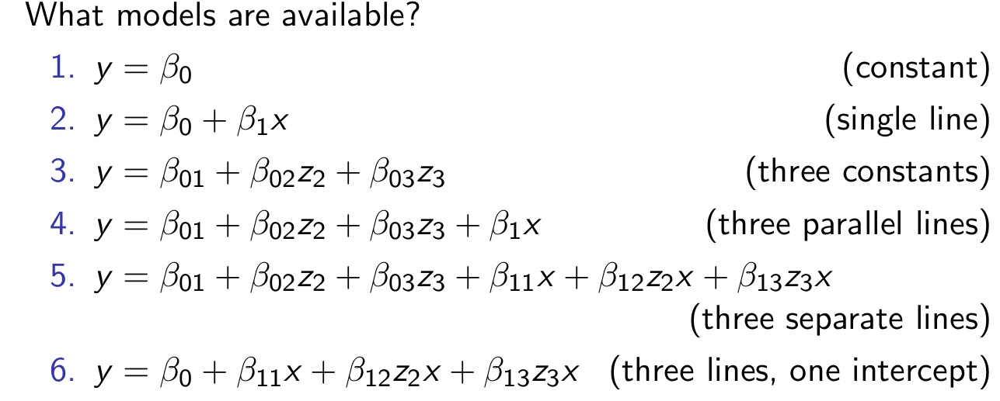

# Linear Model Framework

Multiple linear regression model can be written as

$$\mathbf{y} = \mathbf{X}\mathbf{\beta} + \mathbf{\epsilon}$$

where $\mathbf{X}$ is the *design matrix*. It can have...

* intercept
* Coding factors
* Coding interactions
* Polynomial regression
* Splines

(The above are all *features*, in ML terms, that we are examining, e.g. x1, x2, x1^2^, x1*x2, etc.)

*Design Matrix* refers to when we would design the experiment before taking the data, so the columns are things you would want to measure.

Note that if  $\mathbf{X}$ is not full rank (a column or multiple columns can be expressed as linear combos of other columns), there can be ambiguity in the solution.

## Coding Factors (separate intercepts)

* Factors are categorical variables that may or may not be ordered
* Code them using 1's and 0's
* Can represent using _treatment contrasts_ or _Sum (to zero) contrasts_ - **Look up a bit more about these _contrast_ representations**
* It sounds like the above representation might make sense when the question is "how does category x change y compared to our baseline category". Historically, they were called _contrasts_ because you were looking at the contrast between e.g. treatment a and treatment b.
* _sum to zero contrasts_ means beta vectors sum to 0.

For a data set with a continuous response (y), a categorical variable (z), and a continuous explanatory (x), what models are available?

## Polynomial Regression

* Simple way to make relationship between X and Y non-linear
* Often good theoretical reason to do this (see physics)
* Including higher order terms directly in design matrix is an option
* Orthogonal polynomials are good because it allows you to test all the way up to x^n^ without having correlation between columns, **if you remove terms the coefficients in the model won't change**.

## Splines

Splines extend the idea of polynomial regression

* Do polynomial regression, but piecewise, joining at *knots*.
  * $$y = \beta_0P_0(x) + \beta_1P_1(x) + ... + \beta_k P_k(x)$$
* The $P_i (x)$ are *basis functions.* They are polynomial functions that are sometimes constrained to be non-zero for only certain values of x.
* See below example (grey lines are knots)
* Since it is still doing linear optimization, you will always get a solution.

Splines are more useful as fits to data, but not good for interpretibility of coefficients. Can still be used for predictions.

# Generalized Linear Models

GLM extend LMs by allowing for

* non-gaussian errors
* A _link function_ that transforms the linear model response

E[y] = $\mathbf{X}\beta$

Model so far assumes $\epsilon$ is iid, N(0, $\sigma^2$)

**NOTE: to relax iid constraint, we get into spatial models, mixed-effect models, and time series models. These could each be their own course.**

GLM does the following:

$$f(E[y]) = \mathbf{X}\beta$$

where f() is the link function.

**Read more about this. I didn't understand much of the following sections...**

## Logistic Regression

In binomial logistic regression, the errors are binomial and the link function is logistic. 

$$f(E[y]) = \frac{E[y]}{1 - E[y]}$$

In this context, E[y] = p, the binomial probability. The model for E[y] is 

$$f(p) = \frac{p}{1-p} = \mathbf{X}\beta$$

or

$$p = \frac{exp(\mathbf{X}\beta)}{1 + exp(\mathbf{X}\beta)}$$

* Fit by maximizing likelihood of y as a function of $\beta$.
* Model comparison via deviance
* Confidence intervals for $\beta$ using the likelihood

## Ordinal Regression

Ordinal response, link is usually logistic

Here we look at cumulative probabilities $\gamma_j$ = P(y $\le$ j)

$$\log{\frac{\gamma_j}{1 - \gamma_j}} = \eta_j - X\beta$$

## Poisson Regression

Errors are Poisson, link function most commonly log

Recall that Poisson is for count data that arise from a Poisson process

## Example: Head Injuries

...

Check out "GLM Examples" on website.